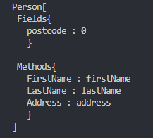

# Dynamic ToString

The method *ToString()* return the fields and methods of this class without to write some extra code in to *ToString()* method.
You can remove or add fields/methods and the *ToString()* method will be continue to work with new changes.

### ToString method
```
 public override string ToString(){
    string output;
```
### Get the name of class
```            
    output = this.GetType().Name + "[ \n " + "Fields{ \n   ";
```
### Get the **public** fields of class
```
    foreach (FieldInfo info in this.GetType().GetFields())
        output += info.Name + " : " + info.GetValue(this) + "\n   ";
            
    output += "} \n\n " + "Methods{ \n   ";
```
### Get the **public** methods of class
```
    foreach (PropertyInfo info in this.GetType().GetProperties())
        output += info.Name + " : " + info.GetValue(this) + "\n   ";
```
### Close ToString()  
```          
    output +="}\n]";             
            
    return output;
}
```

### This is the output of ToString() method

(private) firstName <- firstName

(private) lastName <- lastName

(private) address <- address

(public) postcode <- 0

<div align="center">
    
</div>


